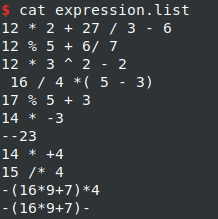
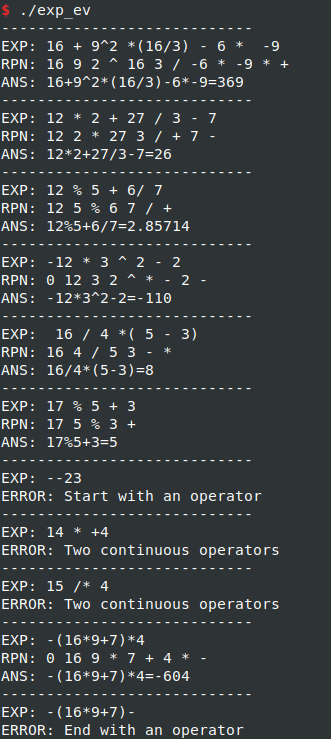
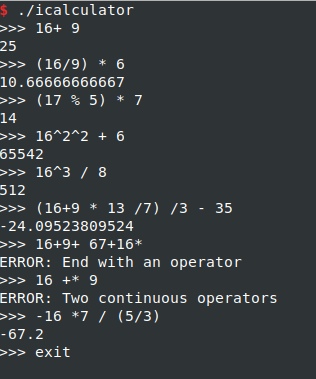

## Expression evaluator

Operators supported:

+ \+
+ \-
+ \*
+ \/
+ \%
+ \^
+ ( )

## I. Steps
 1. Validate the input expression and standardize it.

 ` 16 + 9^2 *(16/3) - 6 *  -9 `

 ==> `16+9^2*(16/3)-6*-9`

 2. Convert to RPN(Reverse Polish Notation)

 ==> `["16", "9", "2", "^", "16", "3", "/", "-6", "*", "-9", "*", "+"]`

 3. Evaluate the RPN

 ==> `369` 

## II. Examples

### 1. `example/expression_eval/`

evaluate the expressions in file `expression.list` 

### 2. `example/calculator/`

A simple calculator.

## END

<leopard.c@outlook.com>
